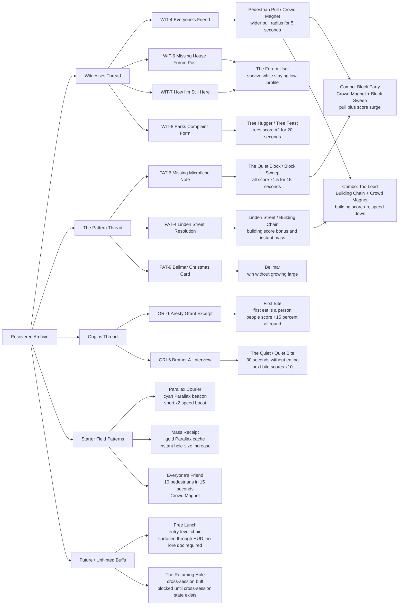

# Archive / Achievement Spider Map

Status: project artifact only. Do not ship this page or diagram inside the player-facing game package unless a future backlog item explicitly promotes an in-game archive map.

Purpose: show how the recovered archive threads connect to lore-based achievements and active buffs.

## Notes

- Starter Field Patterns stay visible in the Archive so new players can understand the first three useful patterns without solving lore clues.
- Other archive-linked achievements should remain discoverable through documents, not explained directly in the How to Play screen.
- This artifact is for product/design alignment, QA reviews, and future implementation planning.
